# BeatLume

**A graph-driven AI fiction workspace for planning, drafting, and exporting full-length stories.**

BeatLume takes you from a one-line premise to a complete, exportable manuscript — powered by AI scaffolding, scene-by-scene drafting, and whole-story generation. It is not just a planner: the guaranteed outcome is a **full generated story** you can iterate on and export.

**Live app:** [https://beatlume.up.railway.app](https://beatlume.up.railway.app/)

> **Try it now** — log in with the demo account `elena@beatlume.io` / `beatlume123`, or create your own account and start writing.

---

## Screenshots

### Onboarding

When you first sign up, a short onboarding wizard introduces BeatLume and captures your writing style.

| Welcome | Writing Preferences |
|---------|-------------------|
| 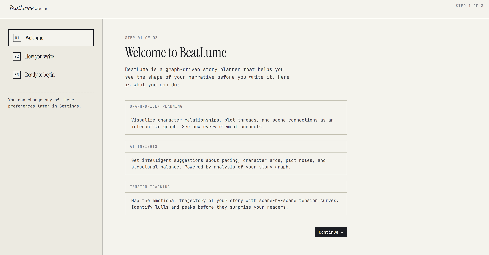 | 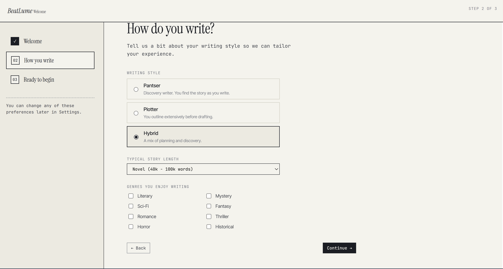 |

### Story Creation Wizard

Create a new story in four guided steps — premise, structure, characters, and scaffold preview.

**Step 1 — Premise:** Give your story a title, logline, genre, subgenre, and themes.

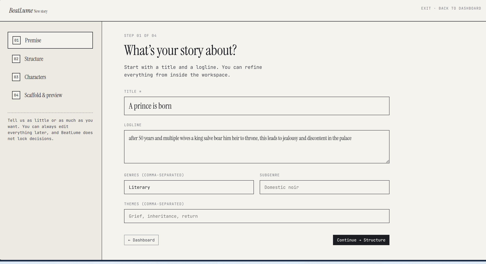

**Step 2 — Structure:** Pick a story type (Short Story, Novelette, Novella, Novel, Epic) and an act structure (Three-Act, Save the Cat, Hero's Journey, Five-Act, or Freeform).

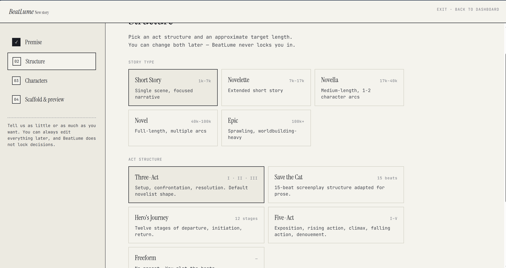

**Step 3 — Characters:** Add your characters with roles (Protagonist, Antagonist, etc.). BeatLume suggests relationship edges automatically.

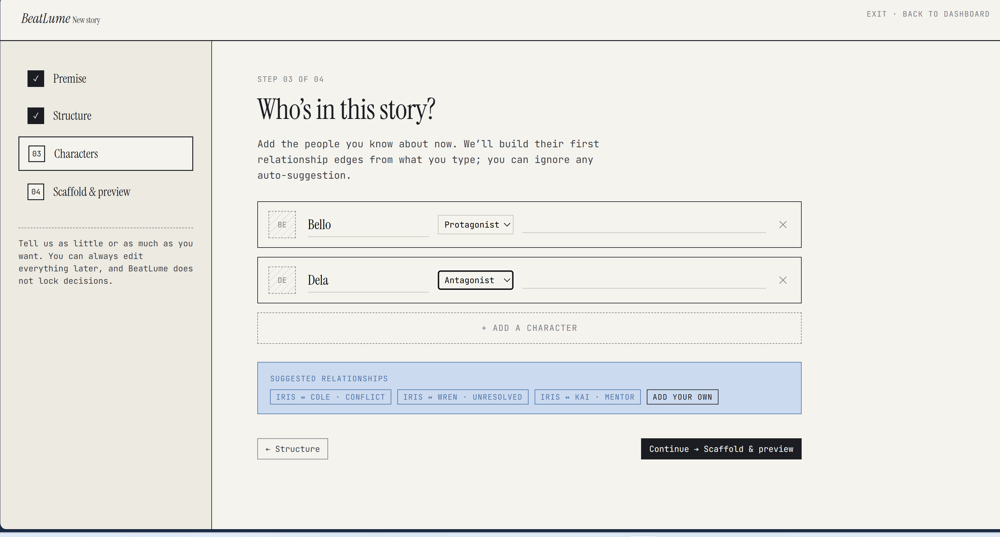

**Step 4 — Scaffold & Preview:** Review your workspace setup before creating the story. Nothing is locked — you can change everything later.

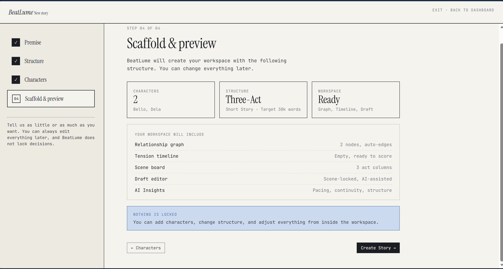

### Story Workspace

Once created, your story opens into a full workspace with planning, drafting, and publishing tools.

**Overview** — See your story's premise, word target, genre tags, and a tension curve at a glance. The AI chat panel offers quick-start prompts. Hit **Generate Story Structure** to scaffold scenes instantly.

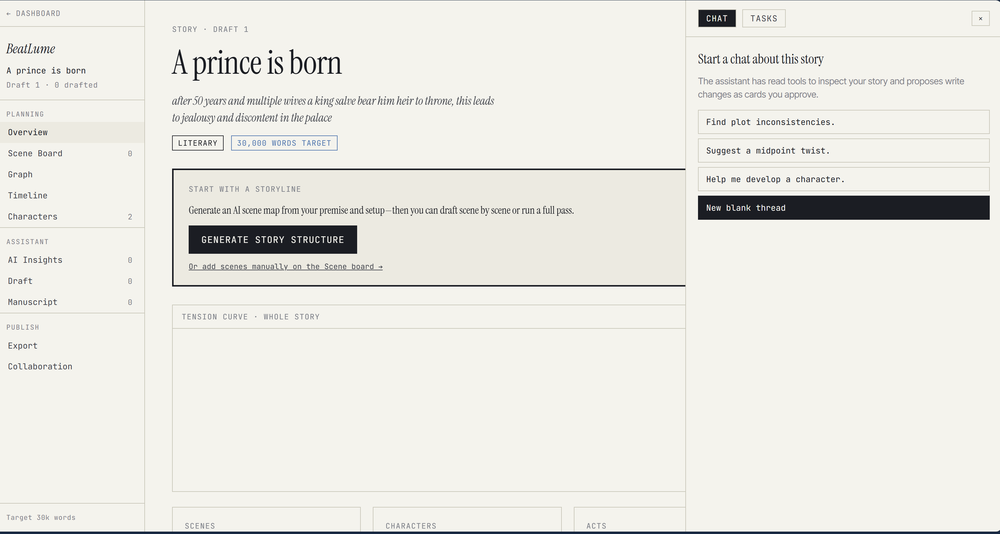

**Scene Board** — All your scenes organized by act. Drag to reorder, move between acts, filter, and sort. Each card shows the POV character and tension score.

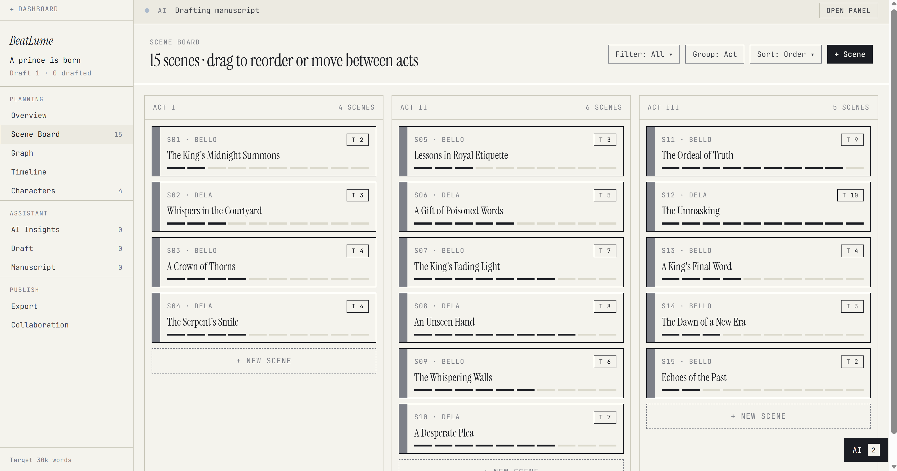

**Graph** — Visualize character relationships as an interactive network. Switch between Characters, Scenes, Subplots, and Mixed views. Use the Tasks panel to trigger AI actions like generating insights, inferring relations, or running a full draft.

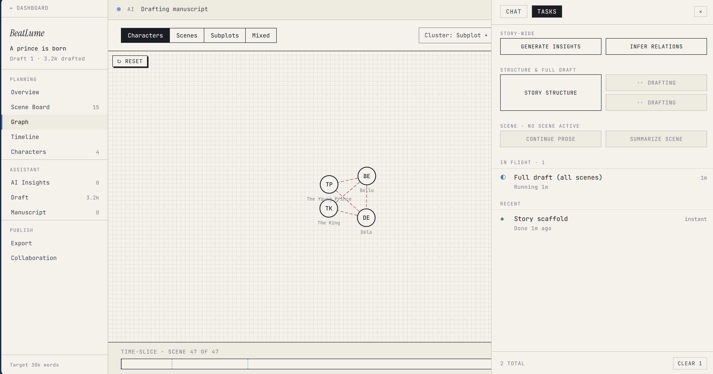

**Timeline** — A tension curve showing the emotional arc across all scenes. See act boundaries, midpoint and climax markers, and statistical metrics (mean, max, std dev).

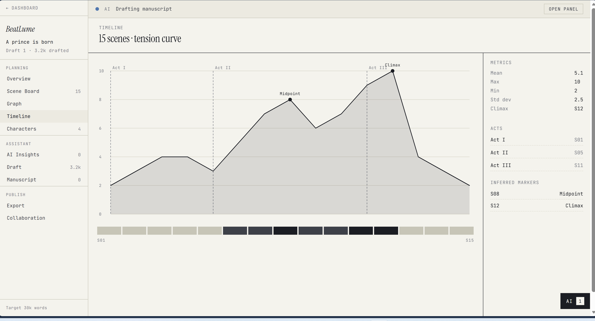

**Draft Editor** — Write scene by scene with full story context in the sidebar: participants, active relationships, prior scene summary, and scene targets. Toggle between Outline mode and AI-assisted continuation.

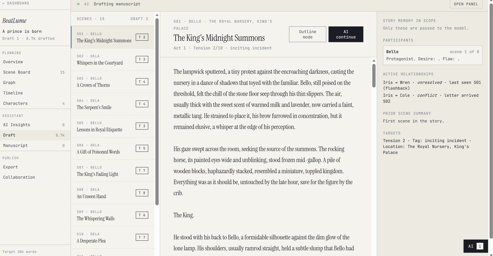

**Manuscript** — The assembled manuscript with chapter headings, word count, reading time, and page count. Export directly to **PDF** or **DOCX**.

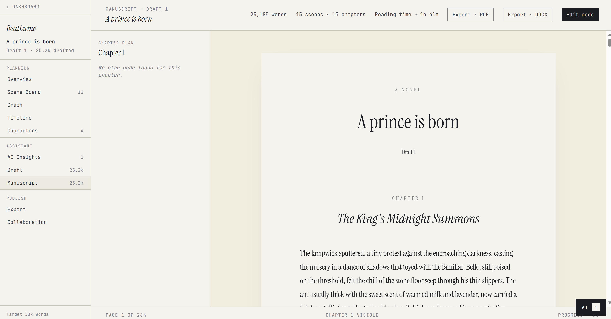

---

## Features

- **Guided story setup** — four-step wizard for premise, structure, characters, and AI scaffold
- **AI story scaffolding** — generate a full scene map from your premise in one click
- **Scene board** — drag-and-drop scene management grouped by act
- **Character graph** — interactive relationship visualization with auto-inferred edges
- **Tension timeline** — scene-by-scene emotional arc with act boundaries and climax markers
- **Draft editor** — scene-locked writing with AI continuation and story memory in scope
- **Full manuscript generation** — AI drafts all scenes in order, streaming progress in real time
- **Manuscript viewer** — paginated chapter view with word count and reading time
- **Export** — download your manuscript as PDF, DOCX, ePub, or plain text
- **AI insights** — pacing analysis, plot hole detection, character arc suggestions
- **AI chat** — story-scoped assistant that can inspect your data and propose changes
- **Collaboration** — invite collaborators to your story workspace
- **Real-time feedback** — SSE-powered progress updates for all AI tasks

---

## Getting Started

### Try the Live App

1. Go to [https://beatlume.up.railway.app](https://beatlume.up.railway.app/)
2. **Log in** with `elena@beatlume.io` / `beatlume123` to explore a pre-seeded workspace, or **sign up** for a fresh account
3. Click **New Story** from the dashboard
4. Walk through the setup wizard: enter a title and logline, pick your structure, add characters
5. On the final step, click **Create Story** to scaffold your workspace
6. From the story overview, click **Generate Story Structure** to let AI create your scene map
7. Use the **Tasks** panel or click **Full Draft** to generate prose for all scenes
8. Open the **Manuscript** view to read the assembled book and export as PDF or DOCX

---

## Monorepo Layout

```text
beatlume/
├── frontend/               React + Vite + TanStack Router + TanStack Query + Zustand
├── backend/                FastAPI + SQLAlchemy + PostgreSQL + LangGraph + Celery
├── docs/                   Architecture, API, deployment, contribution, and product docs
├── images/                 App screenshots
├── scripts/                Local development helpers
├── CLAUDE.md               Product and repo context for coding agents
├── AGENTS.md               Agent workflow rules for this repo
└── Makefile                Common setup, dev, test, and infra commands
```

## Architecture At A Glance

```text
Frontend routes/components
  -> TanStack Query hooks
    -> FastAPI routes
      -> services
        -> SQLAlchemy + PostgreSQL
        -> Celery tasks for AI/export
          -> Redis pub/sub
            -> SSE back to the browser
```

## Tech Stack

### Frontend

- React 19, Vite, TypeScript
- TanStack Router (file-based routing)
- TanStack Query (server state)
- Zustand (auth + UI state)

### Backend

- FastAPI (async), Python 3.12
- SQLAlchemy 2 (async) + PostgreSQL 16 + Alembic
- LangGraph + LiteLLM (AI workflows)
- Celery + Redis (background tasks + pub/sub)
- OpenTelemetry + structlog (observability)

---

## Local Development

### Prerequisites

- Node.js 20+
- Python 3.12+
- `uv`
- PostgreSQL running locally on `localhost:5432`
- Redis running locally on `localhost:6379`

Local development defaults:

- PostgreSQL database: `beatlume`
- PostgreSQL user: `beatlume`
- PostgreSQL password: `beatlume_dev`
- Redis URL: `redis://localhost:6379/0`

### One-Time Setup

```bash
make setup
```

This installs dependencies, creates the database, runs migrations, and seeds local data.

Seed login:
- Email: `elena@beatlume.io`
- Password: `beatlume123`

### Run The App

```bash
make dev
```

Useful variants:

```bash
make dev-backend
make dev-frontend
make dev-stop
make celery-all
```

Default local URLs:

- Frontend: `http://localhost:5173`
- API: `http://localhost:8000`
- Health check: `http://localhost:8000/health`

## Testing

```bash
make test              # all tests
make test-backend      # backend only (pytest)
make test-frontend     # frontend type check
make test-e2e          # Playwright end-to-end
make lint              # linting
```

Direct commands:

```bash
cd backend && PYTHONPATH=. uv run pytest tests/ -v
cd frontend && npx tsc --noEmit
```

---

## Documentation

- [docs/DEVELOPMENT.md](./docs/DEVELOPMENT.md) — developer handbook
- [docs/API.md](./docs/API.md) — API surface, async tasks, and SSE
- [docs/ARCHITECTURE.md](./docs/ARCHITECTURE.md) — systems and algorithms
- [docs/PRINCIPLES.md](./docs/PRINCIPLES.md) — engineering and AI design principles
- [docs/DEPLOYMENT.md](./docs/DEPLOYMENT.md) — deployment guidance
- [docs/CONTRIBUTING.md](./docs/CONTRIBUTING.md) — contribution workflow
- [docs/PRD.md](./docs/PRD.md) — product requirements

## License

Private. All rights reserved.
